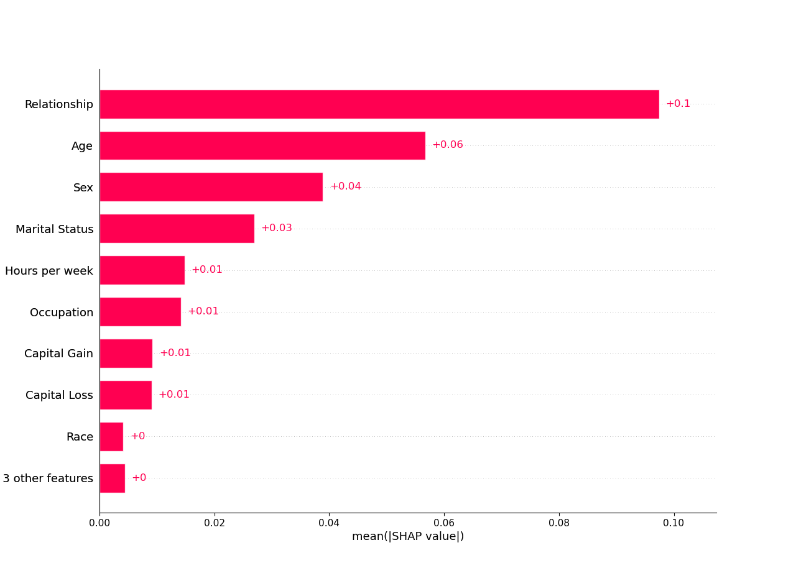
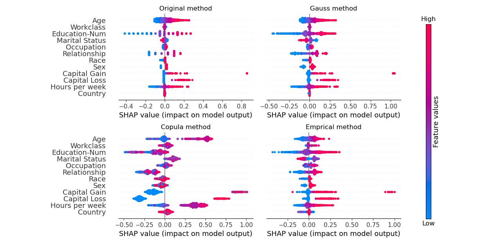
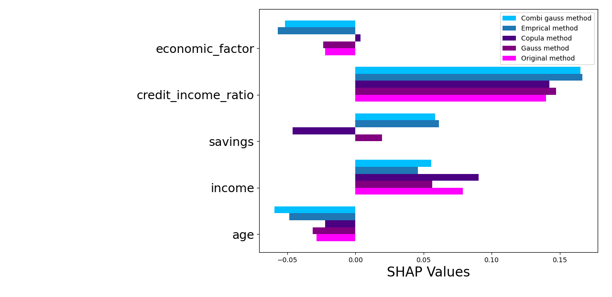
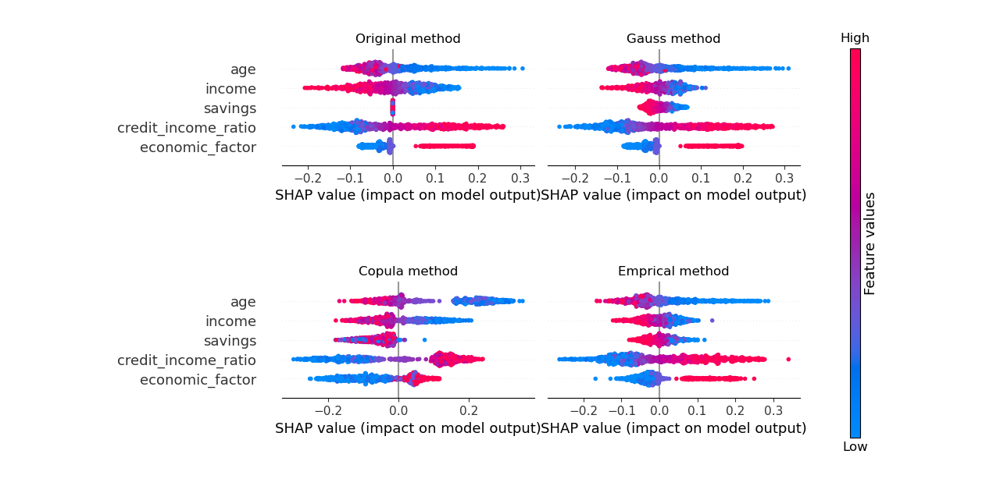

# Shapley values for correlated features

This package contains an extension of the [shap package](https://github.com/shap/shap) based on the paper ['Explaining individual predictions when features are dependent: More accurate
approximations to Shapley values'](https://arxiv.org/abs/1903.10464) that describes methods to more accurately approximate shapley values when features in the dataset are correlated. 

## Installation

To install the package with pip, simply run

`pip install corr-shap`

Alternatively, you can download the [corr_shap repository](https://github.com/Fraunhofer-SCAI/corr_shap) and
create a conda environment with  

`conda env create -f environment.yml`

## Background

### SHAP
SHAP (SHapley Additive exPlanations) is a method to explain the output of a machine learning model.
It uses Shapley values from game theory to compute the contribution of each input feature to the output of the model.
Therefore, it can help users understand the factors influencing a model's decision-making process.
Since the computational effort to calculate Shapley values grows exponentially, approximation methods such as Kernel SHAP are needed. 
See the paper ['A Unified Approach to Interpreting Model Predictions'](http://papers.nips.cc/paper/7062-a-unified-approach-to-interpreting-model-predictions)
by Scott M. Lundberg and Su-In Lee for more details on Kernel SHAP or their [SHAP git repo](https://github.com/shap/shap) for the implementation.

### Correlated Explainer
One disadvantage of Kernel SHAP is the fact that it assumes that all features are independent.
If there is a high correlation between the features, the results of Kernel SHAP can be inaccurate.
Therefore, Kjersti Aas, Martin Jullum and Anders Løland propose an extension of Kernel SHAP in their paper 
['Explaining individual predictions when features are dependent: More accurate
approximations to Shapley values'](https://arxiv.org/abs/1903.10464). 
Instead of assuming feature independence, they use either a Gaussian distribution, 
a Gaussian copula distribution, an empirical conditional distribution, 
or a combination of the empirical distribution with one of the other two.
This can produce more accurate results in case of dependent features.

Their proposed method is implemented in the 'CorrExplainer' class. Based on the chosen sampling strategy, the CorrExplainer 
uses one of the distributions mentioned above or returns the same result as the Kernel Explainer (while having a faster runtime) 
in case the 'default' sampling strategy is chosen.
In our comparisons (with [data sets 'adult', 'linear independent 60' and
'diabetes'](https://shap.readthedocs.io/en/latest/api.html#datasets))
the CorrExplainer was between 6 to 19 times faster than the Kernel Explainer.
However, in its current implementation it is only suitable for the explanation of tabular data.

## Examples
### Explaining a single instance
Below is a code example that shows how to use the CorrExplainer to explain a single instance
of the 'adult' dataset and display the result in a bar plot.

````python
from sklearn import linear_model
from sklearn.model_selection import train_test_split
import shap
from corr_shap.CorrExplainer import CorrExplainer

# load data
x, y = shap.datasets.adult()

# train model
x_training_data, x_test_data, y_training_data, y_test_data \
    = train_test_split(x, y, test_size=0.2, random_state=0)
model = linear_model.LinearRegression()
model.fit(x_training_data, y_training_data)

# create explanation object with CorrExplainer
explainer = CorrExplainer(model.predict, x_training_data, sampling="default")
explanation = explainer(x_test_data[:1])

shap.plots.bar(explanation)
````



### Explaining full 'adult' dataset

To get a sense, which features are most important in the whole dataset and not just a single instance, the shap values 
for each feature and each sample can be visualized in the same plot.
See example code [here](examples/adult_beeswarmplot.py).



### Credit default data
Another example with a credit default dataset from the [rivapy package](https://github.com/RIVACON/RiVaPy) with high correlation between the features 'income' and 'savings' 
and a model that ignores the 'savings' feature can be found [here](examples/credit_default.py).

Bar plot explaining a single instance:


Summary plot explaining multiple samples:


Further examples can be found in the [examples](examples) folder.

## References
* ['A Unified Approach to Interpreting Model Predictions'](http://papers.nips.cc/paper/7062-a-unified-approach-to-interpreting-model-predictions) 
Scott M. Lundberg, Su-In Lee
* ['Explaining individual predictions when features are dependent: More accurate approximations to Shapley values'](https://arxiv.org/abs/1903.10464) 
Kjersti Aas, Martin Jullum and Anders Løland
* [shap package](https://github.com/shap/shap)
* [rivapy package](https://github.com/RIVACON/RiVaPy)
